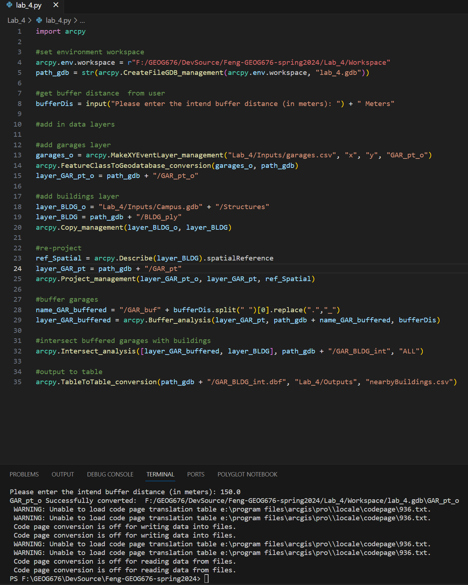
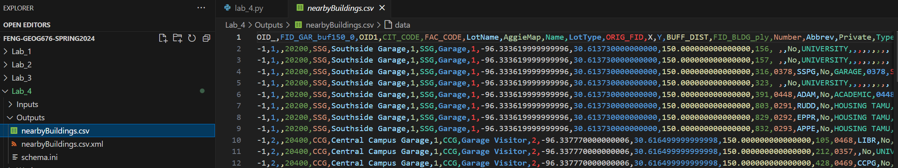
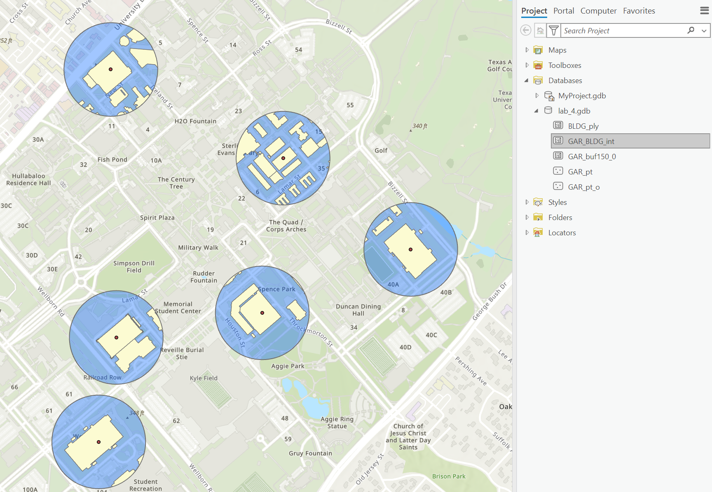

# Guangxi Feng 24 SPRING GEOG 676: GIS PROGRAMMING
### Lab4  Fun with ArcPy

- [Lab4 Python code](lab_4.py)
- [Lab4 Geodatabase](Workspace/lab_4.gdb/)
- [Lab4 Output Intersection Table](Outputs/nearbyBuildings.csv)
- [Lab4 Screenshot of results](Screenshot)

