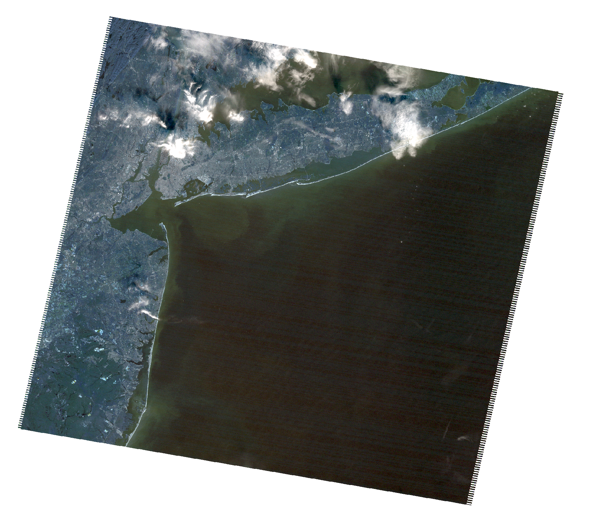
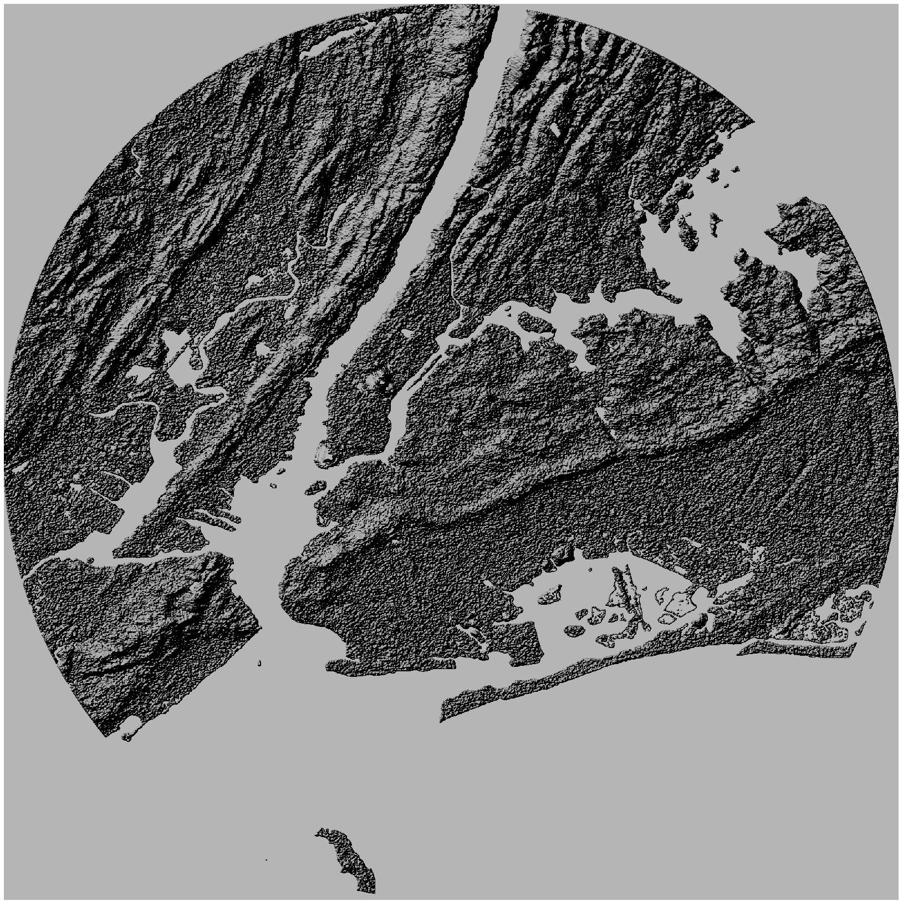
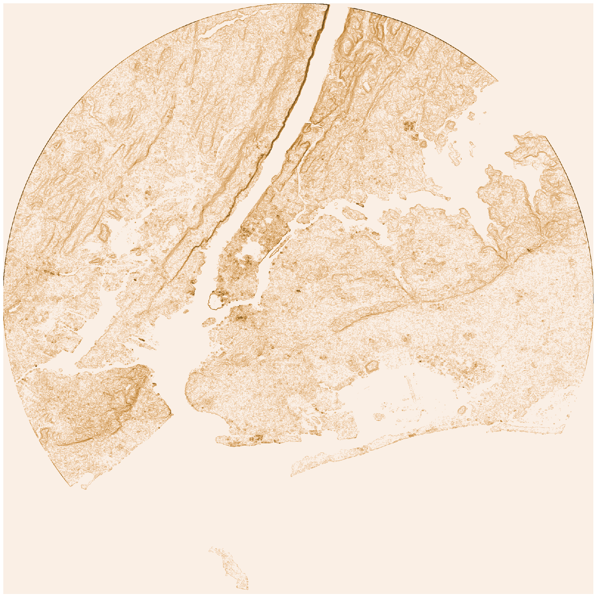

# Guangxi Feng 24 SPRING GEOG 676: GIS PROGRAMMING
### Lab7 Raster analysis

- [Lab7 Python code](lab_7.py)      
- [Lab7 Raster analysis results](Outputs)      
- [Lab7 Screenshot of results](Screenshot)  
Composite
  
Hillshade
  
Slope
  
